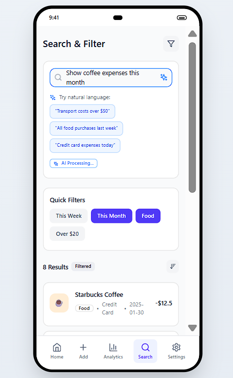
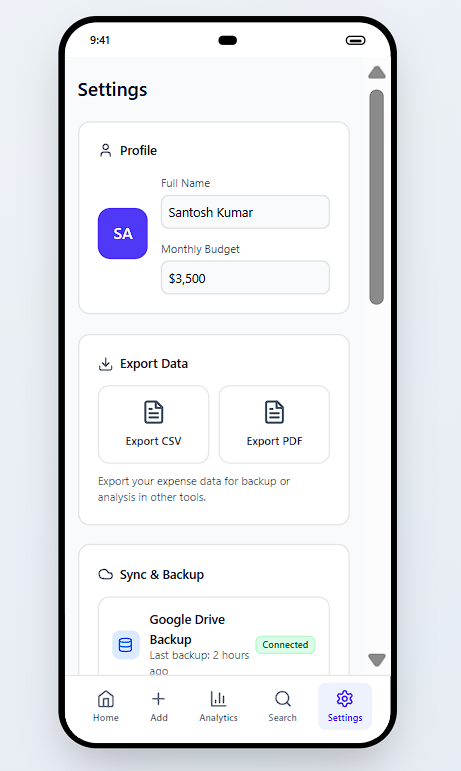

# Expense Tracker (Vite + React)

This workspace contains React + TypeScript mockups and UI components.

Note: The editing environment here doesn't have Node/npm available. Run the following commands locally on your machine (PowerShell) to install dependencies and start the dev server.

PowerShell commands:

```powershell
Set-Location -LiteralPath 'D:\APP Dev\Expense Tracker'
npm install
npm run dev
```

If you prefer pnpm or yarn, use those instead:

pnpm:
```powershell
pnpm install
pnpm dev
```

yarn:
```powershell
yarn
yarn dev
```

Files added:
- `package.json` — dependency list and scripts
- `tsconfig.json` — TypeScript config
- `vite.config.ts` — Vite + React plugin
- `index.html` — Vite entry
- `.gitignore`

## Preview

Below are quick previews of the five mockup screens in order: Home (Dashboard), Add Expense, Analytics, Search & Filter, and Settings. These are static SVG mock previews — replace them with real screenshots if you prefer.

Home (Dashboard)


Add Expense


Analytics


Search & Filter



Settings




### How to create the review video

1. Run the app locally:

```powershell
Set-Location -LiteralPath 'D:\APP Dev\Expense Tracker'  
npm.cmd run dev
```

2. Open the preview URL (usually http://localhost:3000) and record a short walkthrough (30–90s) using your screen recorder.


